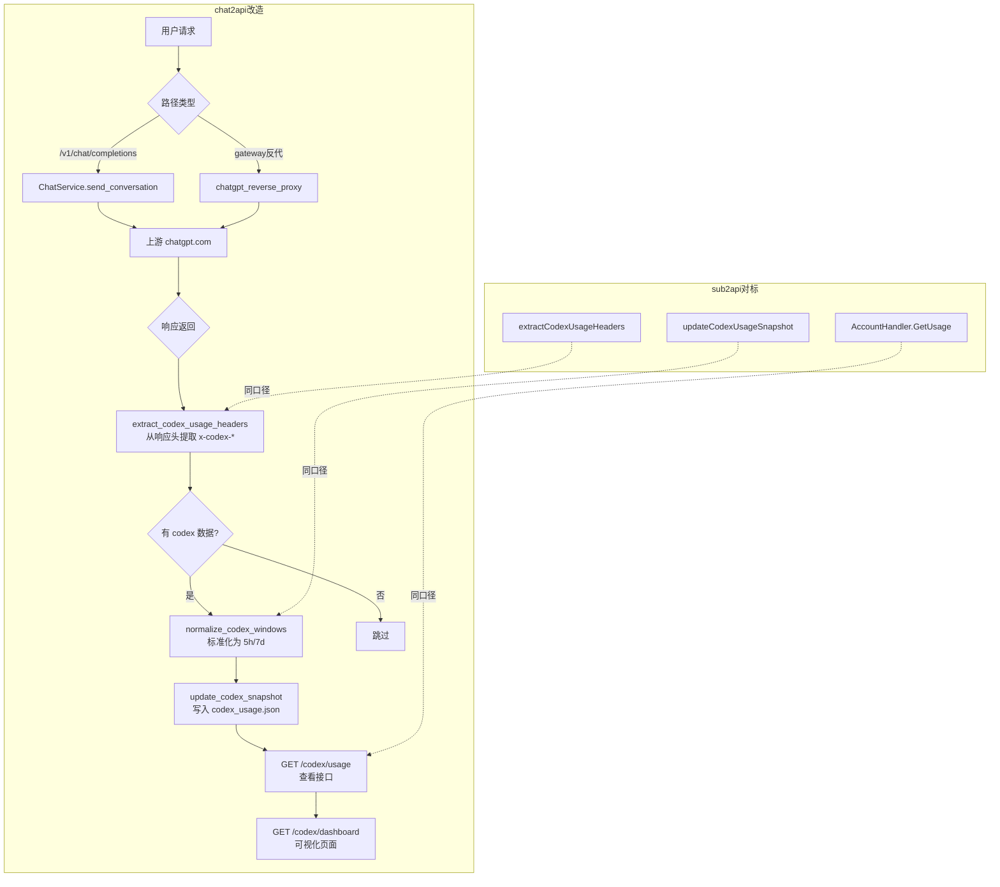

# chat2api 复刻 sub2api Codex 监控 — 完整改造方案

## 一、核心思路对齐

sub2api 的 Codex 监控本质是：

1. **被动抓取**：请求经由网关转发到 `chatgpt.com/backend-api/codex/responses`，在上游**响应头**中提取 `x-codex-*` 系列字段
2. **快照落库**：将 primary/secondary 窗口数据标准化为 5h/7d 两个维度，存入账号的 `extra` 字段（JSON map）
3. **接口暴露**：通过 `GET /api/v1/admin/accounts/:id/usage` 返回数据给前端

chat2api 是 Python/FastAPI 项目，请求通过 `chatgpt_reverse_proxy()` 直接代理到上游。改造策略是在**响应返回后**插入一个钩子函数读取响应头，保存到文件或内存。

---

## 二、改造点清单（精确到文件/函数）

### 改造 1：新增 Codex 快照数据模型 + 存储

**新建文件** `chatgpt/codexUsage.py`

功能：
- 定义 `CodexUsageSnapshot` 数据结构（与 sub2api 的 `OpenAICodexUsageSnapshot` 对齐）
- 提供 `extract_codex_usage_headers(headers)` 函数，从响应头提取 `x-codex-*` 字段
- 提供 `normalize_codex_windows(snapshot)` 函数，根据 `window_minutes` 大小自动判断 5h/7d
- 提供 `update_codex_snapshot(token, snapshot)` 函数，将快照写入 `data/codex_usage.json`（token → snapshot 映射）
- 提供 `get_codex_snapshot(token)` 函数，读取某个 token 的快照数据

对标 sub2api 代码：
- `backend/internal/service/openai_gateway_service.go` 第 1668-1878 行

```python
# chatgpt/codexUsage.py

import json
import os
import time
from datetime import datetime, timezone
from typing import Optional, Dict, Any

CODEX_USAGE_FILE = os.path.join("data", "codex_usage.json")

# Global in-memory cache, persisted to file
_codex_usage_map: Dict[str, Dict[str, Any]] = {}

# Load on startup
if os.path.exists(CODEX_USAGE_FILE):
    with open(CODEX_USAGE_FILE, "r") as f:
        try:
            _codex_usage_map = json.load(f)
        except:
            _codex_usage_map = {}


def _parse_float(headers, key) -> Optional[float]:
    v = headers.get(key)
    if v:
        try:
            return float(v)
        except:
            pass
    return None


def _parse_int(headers, key) -> Optional[int]:
    v = headers.get(key)
    if v:
        try:
            return int(v)
        except:
            pass
    return None


def extract_codex_usage_headers(headers) -> Optional[Dict[str, Any]]:
    """Extract x-codex-* headers from upstream response (aligned with sub2api)."""
    snapshot = {}
    has_data = False

    # Primary limits
    if (v := _parse_float(headers, "x-codex-primary-used-percent")) is not None:
        snapshot["primary_used_percent"] = v
        has_data = True
    if (v := _parse_int(headers, "x-codex-primary-reset-after-seconds")) is not None:
        snapshot["primary_reset_after_seconds"] = v
        has_data = True
    if (v := _parse_int(headers, "x-codex-primary-window-minutes")) is not None:
        snapshot["primary_window_minutes"] = v
        has_data = True

    # Secondary limits
    if (v := _parse_float(headers, "x-codex-secondary-used-percent")) is not None:
        snapshot["secondary_used_percent"] = v
        has_data = True
    if (v := _parse_int(headers, "x-codex-secondary-reset-after-seconds")) is not None:
        snapshot["secondary_reset_after_seconds"] = v
        has_data = True
    if (v := _parse_int(headers, "x-codex-secondary-window-minutes")) is not None:
        snapshot["secondary_window_minutes"] = v
        has_data = True

    # Overflow ratio
    if (v := _parse_float(headers, "x-codex-primary-over-secondary-limit-percent")) is not None:
        snapshot["primary_over_secondary_percent"] = v
        has_data = True

    if not has_data:
        return None

    snapshot["updated_at"] = datetime.now(timezone.utc).isoformat()
    return snapshot


def normalize_codex_windows(snapshot: Dict[str, Any]) -> Dict[str, Any]:
    """Normalize primary/secondary to canonical 5h/7d fields (same logic as sub2api)."""
    result = dict(snapshot)  # Copy raw fields

    primary_window = snapshot.get("primary_window_minutes")
    secondary_window = snapshot.get("secondary_window_minutes")

    use_5h_from_primary = use_7d_from_primary = False
    use_5h_from_secondary = use_7d_from_secondary = False

    if primary_window is not None and secondary_window is not None:
        if primary_window < secondary_window:
            use_5h_from_primary = True
            use_7d_from_secondary = True
        else:
            use_5h_from_secondary = True
            use_7d_from_primary = True
    elif primary_window is not None:
        if primary_window <= 360:
            use_5h_from_primary = True
        else:
            use_7d_from_primary = True
    elif secondary_window is not None:
        if secondary_window <= 360:
            use_5h_from_secondary = True
        else:
            use_7d_from_secondary = True
    else:
        # Fallback: assume primary=7d, secondary=5h
        use_5h_from_secondary = True
        use_7d_from_primary = True

    # Write 5h fields
    src_5h = "primary" if use_5h_from_primary else ("secondary" if use_5h_from_secondary else None)
    if src_5h:
        for suffix in ["used_percent", "reset_after_seconds", "window_minutes"]:
            key = f"{src_5h}_{suffix}"
            if key in snapshot:
                result[f"codex_5h_{suffix}"] = snapshot[key]

    # Write 7d fields
    src_7d = "primary" if use_7d_from_primary else ("secondary" if use_7d_from_secondary else None)
    if src_7d:
        for suffix in ["used_percent", "reset_after_seconds", "window_minutes"]:
            key = f"{src_7d}_{suffix}"
            if key in snapshot:
                result[f"codex_7d_{suffix}"] = snapshot[key]

    return result


def update_codex_snapshot(token_key: str, snapshot: Dict[str, Any]):
    """Save normalized codex snapshot for a token."""
    normalized = normalize_codex_windows(snapshot)
    _codex_usage_map[token_key] = normalized
    _persist()


def get_codex_snapshot(token_key: str) -> Optional[Dict[str, Any]]:
    """Get stored codex snapshot for a token."""
    return _codex_usage_map.get(token_key)


def get_all_codex_snapshots() -> Dict[str, Dict[str, Any]]:
    """Get all codex snapshots."""
    return dict(_codex_usage_map)


def _persist():
    with open(CODEX_USAGE_FILE, "w", encoding="utf-8") as f:
        json.dump(_codex_usage_map, f, indent=2)


# ========== Token Config Management (name mapping) ==========

TOKEN_CONFIG_FILE = os.path.join("data", "token_config.json")

# Structure: { token_key(first 20 chars): { "name": "自定义名称", "full_token": "完整token" } }
_token_config_map: Dict[str, Dict[str, str]] = {}

if os.path.exists(TOKEN_CONFIG_FILE):
    with open(TOKEN_CONFIG_FILE, "r") as f:
        try:
            _token_config_map = json.load(f)
        except:
            _token_config_map = {}


def add_token_config(full_token: str, name: str) -> str:
    """Register a token with a custom display name. Returns token_key."""
    token_key = full_token[:20]
    _token_config_map[token_key] = {
        "name": name,
        "full_token": full_token,
        "created_at": datetime.now(timezone.utc).isoformat()
    }
    _persist_token_config()
    return token_key


def update_token_config(token_key: str, name: str) -> bool:
    """Update display name for a token."""
    if token_key not in _token_config_map:
        return False
    _token_config_map[token_key]["name"] = name
    _persist_token_config()
    return True


def delete_token_config(token_key: str) -> bool:
    """Remove a token config."""
    if token_key not in _token_config_map:
        return False
    del _token_config_map[token_key]
    _persist_token_config()
    # Also remove usage data
    if token_key in _codex_usage_map:
        del _codex_usage_map[token_key]
        _persist()
    return True


def get_all_token_configs() -> Dict[str, Dict[str, str]]:
    """Get all token configs."""
    return dict(_token_config_map)


def get_token_name(token_key: str) -> Optional[str]:
    """Get display name for a token_key."""
    config = _token_config_map.get(token_key)
    return config["name"] if config else None


def get_all_codex_snapshots_with_names() -> Dict[str, Dict[str, Any]]:
    """Get all codex snapshots, each enriched with token display name."""
    result = {}
    # Include all configured tokens (even if no usage yet)
    all_keys = set(list(_codex_usage_map.keys()) + list(_token_config_map.keys()))
    for key in all_keys:
        snapshot = dict(_codex_usage_map.get(key, {}))
        config = _token_config_map.get(key, {})
        snapshot["token_name"] = config.get("name", "")
        snapshot["token_key"] = key
        result[key] = snapshot
    return result


def _persist_token_config():
    with open(TOKEN_CONFIG_FILE, "w", encoding="utf-8") as f:
        json.dump(_token_config_map, f, indent=2)
```

---

### 改造 2：在反向代理请求链路中埋点

**修改文件** `gateway/reverseProxy.py` → `chatgpt_reverse_proxy()` 函数

在上游响应返回后，检查是否包含 `x-codex-*` 响应头，如果有则提取并保存。

**插入位置**：在 `r = await client.request(...)` 成功返回后，所有分支返回 response 之前

```python
# 在 chatgpt_reverse_proxy 函数中，r 返回后、return response 之前插入:
from chatgpt.codexUsage import extract_codex_usage_headers, update_codex_snapshot

# ... existing code after r = await client.request(...)
# Extract Codex usage snapshot (aligned with sub2api's extractCodexUsageHeaders)
try:
    codex_snapshot = extract_codex_usage_headers(dict(r.headers))
    if codex_snapshot and req_token:
        update_codex_snapshot(req_token[:20], codex_snapshot)  # Use first 20 chars of token as key
except Exception:
    pass  # Don't affect main flow
```

**具体位置**：在 `r.status_code` 判断分支之前（约在 `r = await client.request(...)` 之后），加一段提取逻辑。

---

### 改造 3：在 ChatService (API 转发) 链路中也埋点

**修改文件** `chatgpt/ChatService.py` → `send_conversation()` 方法

在 `r = await self.s.post_stream(...)` 返回后，同样提取响应头。

```python
# 在 send_conversation() 中 r 返回后插入：
from chatgpt.codexUsage import extract_codex_usage_headers, update_codex_snapshot

try:
    codex_snapshot = extract_codex_usage_headers(dict(r.headers))
    if codex_snapshot and self.req_token:
        update_codex_snapshot(self.req_token[:20], codex_snapshot)
except Exception:
    pass
```

---

### 改造 4：新增 Codex Usage 查看 API

**修改文件** `api/chat2api.py`

新增两个接口：

```python
from chatgpt.codexUsage import (
    get_codex_snapshot, get_all_codex_snapshots,
    get_all_codex_snapshots_with_names,
    add_token_config, update_token_config, delete_token_config,
    get_all_token_configs, get_token_name
)
from pydantic import BaseModel

class TokenConfigRequest(BaseModel):
    token: str          # Full token string
    name: str           # Custom display name

class TokenRenameRequest(BaseModel):
    name: str           # New display name

# Get Codex usage for a single token
@app.get(f"/{api_prefix}/codex/usage/{{token_prefix}}" if api_prefix else "/codex/usage/{token_prefix}")
async def get_token_codex_usage(token_prefix: str):
    snapshot = get_codex_snapshot(token_prefix)
    if snapshot:
        snapshot["token_name"] = get_token_name(token_prefix) or ""
        return {"status": "success", "data": snapshot}
    return {"status": "not_found", "data": None}

# Get Codex usage for all tokens (with display names)
@app.get(f"/{api_prefix}/codex/usage" if api_prefix else "/codex/usage")
async def get_all_codex_usage():
    return {"status": "success", "data": get_all_codex_snapshots_with_names()}

# ========== Token Config Management APIs ==========

# Add a new token with custom name
@app.post(f"/{api_prefix}/codex/tokens" if api_prefix else "/codex/tokens")
async def create_token_config(req: TokenConfigRequest):
    token_key = add_token_config(req.token, req.name)
    return {"status": "success", "token_key": token_key, "name": req.name}

# List all configured tokens
@app.get(f"/{api_prefix}/codex/tokens" if api_prefix else "/codex/tokens")
async def list_token_configs():
    return {"status": "success", "data": get_all_token_configs()}

# Update token display name
@app.put(f"/{api_prefix}/codex/tokens/{{token_key}}" if api_prefix else "/codex/tokens/{token_key}")
async def rename_token_config(token_key: str, req: TokenRenameRequest):
    ok = update_token_config(token_key, req.name)
    if ok:
        return {"status": "success"}
    return {"status": "not_found", "message": "Token not found"}

# Delete a token
@app.delete(f"/{api_prefix}/codex/tokens/{{token_key}}" if api_prefix else "/codex/tokens/{token_key}")
async def remove_token_config(token_key: str):
    ok = delete_token_config(token_key)
    if ok:
        return {"status": "success"}
    return {"status": "not_found", "message": "Token not found"}
```

---

### 改造 5：（可选）新增账号配置管理

目前 chat2api 的账号管理非常简单——`data/token.txt` 存纯文本 token，`data/fp_map.json` 存浏览器指纹。没有 sub2api 那种完整的账号模型（name/type/credentials/extra/proxy...）。

**如果想加"配置账号"的能力**，有两种方案：

| 方案 | 改动量 | 说明 |
|------|--------|------|
| **A. 轻量扩展** | 小（0.5天） | 在现有 `fp_map.json` 里给每个 token 加 `extra` 字段（类似 sub2api 的 `Account.Extra`），存 codex 快照、备注名、优先级等。不改变现有数据结构 |
| **B. 完整账号模型** | 大（2-3天） | 新建 `data/accounts.json`，定义类似 sub2api 的 Account 结构（name, type, credentials, extra, proxy, status, concurrency, priority），并把 `token.txt` 的功能迁移过来 |

**建议**：先用方案 A，在 `fp_map.json` 上扩展即可，因为 chat2api 本身定位就是轻量代理，没必要引入完整数据库。

方案 A 实现方式：

**修改文件** `utils/globals.py`

新增加载 `codex_usage.json`：

```python
CODEX_USAGE_FILE = os.path.join(DATA_FOLDER, "codex_usage.json")
```

---

### 改造 6：内嵌 Codex Dashboard 前端页面（含 Token 管理）

**新建文件** `static/codex_dashboard.html`

在 chat2api 内嵌一个轻量级单页 Dashboard，无需额外前端框架，纯 HTML + 原生 JS + 内联 CSS，通过调用改造 4 的 API 渲染数据。

**访问路径**：
```
https://core.letaicode.cn/api_7f3Kp9mQ2xL8nV4t/codex/dashboard
```

**页面功能**：
- 📊 **用量监控**：表格展示所有 token 的 Codex 用量
- 🏷️ **自定义名称**：每个 token 卡片顶部醒目显示自定义名称（如 "Jensen的主号"），token_key 作为副标题显示
- ⚙️ **Token 管理**：支持在页面上直接添加 / 编辑名称 / 删除 token
- 📈 每个 token 显示：5h 窗口用量百分比 + 重置倒计时、7d 窗口用量百分比 + 重置倒计时、最后更新时间
- 🎨 用量百分比以进度条 + 颜色分级展示（绿色 <50%、黄色 50-80%、红色 >80%）
- ⏱️ 重置倒计时自动转为人类可读格式（如 "2h 30m"、"3d 12h"）
- 🔄 支持手动刷新 / 自动轮询（每 30s）
- 📱 响应式布局，移动端友好

**修改文件** `api/chat2api.py`

新增 Dashboard 路由：

```python
from fastapi.responses import HTMLResponse
import os

# Codex Dashboard page
@app.get(f"/{api_prefix}/codex/dashboard" if api_prefix else "/codex/dashboard", response_class=HTMLResponse)
async def codex_dashboard():
    html_path = os.path.join(os.path.dirname(__file__), "..", "static", "codex_dashboard.html")
    with open(html_path, "r", encoding="utf-8") as f:
        return HTMLResponse(content=f.read())
```

**Dashboard HTML 核心结构**：

```html
<!-- static/codex_dashboard.html -->
<!DOCTYPE html>
<html lang="en">
<head>
  <meta charset="UTF-8">
  <meta name="viewport" content="width=device-width, initial-scale=1.0">
  <title>Codex Usage Dashboard</title>
  <style>
    * { margin: 0; padding: 0; box-sizing: border-box; }
    body { font-family: -apple-system, BlinkMacSystemFont, 'Segoe UI', sans-serif;
           background: #0f172a; color: #e2e8f0; padding: 20px; }
    h1 { text-align: center; margin-bottom: 20px; color: #38bdf8; }

    /* Tab navigation */
    .tabs { display: flex; gap: 8px; margin-bottom: 20px; justify-content: center; }
    .tab-btn { background: #1e293b; color: #94a3b8; border: 1px solid #334155; padding: 8px 20px;
               border-radius: 8px; cursor: pointer; font-size: 14px; transition: all 0.2s; }
    .tab-btn.active { background: #2563eb; color: white; border-color: #2563eb; }

    /* Cards */
    .card { background: #1e293b; border-radius: 12px; padding: 16px; margin-bottom: 12px;
            border: 1px solid #334155; }
    .card-header { display: flex; justify-content: space-between; align-items: center; margin-bottom: 8px; }
    .token-name { font-size: 18px; font-weight: 600; color: #f1f5f9; }
    .token-name-empty { font-size: 18px; font-weight: 600; color: #475569; font-style: italic; }
    .token-id { font-family: monospace; color: #64748b; font-size: 12px; margin-top: 2px; }
    .card-actions { display: flex; gap: 6px; }
    .icon-btn { background: none; border: 1px solid #334155; color: #94a3b8; padding: 4px 8px;
                border-radius: 4px; cursor: pointer; font-size: 12px; transition: all 0.2s; }
    .icon-btn:hover { border-color: #64748b; color: #e2e8f0; }
    .icon-btn.danger:hover { border-color: #ef4444; color: #ef4444; }

    /* Usage display */
    .usage-row { display: flex; gap: 20px; margin-top: 10px; flex-wrap: wrap; }
    .usage-item { flex: 1; min-width: 200px; }
    .usage-label { font-size: 12px; color: #64748b; margin-bottom: 4px; }
    .progress-bar { height: 8px; background: #334155; border-radius: 4px; overflow: hidden; }
    .progress-fill { height: 100%; border-radius: 4px; transition: width 0.3s; }
    .green { background: #22c55e; }
    .yellow { background: #eab308; }
    .red { background: #ef4444; }
    .usage-text { font-size: 13px; margin-top: 4px; }
    .no-data { color: #475569; font-size: 13px; margin-top: 8px; font-style: italic; }
    .updated { font-size: 11px; color: #475569; margin-top: 8px; }

    /* Toolbar */
    .toolbar { display: flex; justify-content: space-between; align-items: center; margin-bottom: 16px; }
    .btn { color: white; border: none; padding: 8px 16px;
           border-radius: 6px; cursor: pointer; font-size: 14px; transition: background 0.2s; }
    .btn-primary { background: #2563eb; }
    .btn-primary:hover { background: #1d4ed8; }
    .btn-success { background: #16a34a; }
    .btn-success:hover { background: #15803d; }
    .btn-group { display: flex; gap: 8px; }

    /* Modal */
    .modal-overlay { display: none; position: fixed; top: 0; left: 0; right: 0; bottom: 0;
                     background: rgba(0,0,0,0.6); z-index: 100; justify-content: center; align-items: center; }
    .modal-overlay.show { display: flex; }
    .modal { background: #1e293b; border-radius: 12px; padding: 24px; min-width: 400px; max-width: 90vw;
             border: 1px solid #334155; }
    .modal h2 { color: #f1f5f9; margin-bottom: 16px; font-size: 18px; }
    .form-group { margin-bottom: 14px; }
    .form-group label { display: block; font-size: 13px; color: #94a3b8; margin-bottom: 4px; }
    .form-group input { width: 100%; padding: 8px 12px; background: #0f172a; border: 1px solid #334155;
                        border-radius: 6px; color: #e2e8f0; font-size: 14px; outline: none; }
    .form-group input:focus { border-color: #2563eb; }
    .form-group input::placeholder { color: #475569; }
    .form-group .hint { font-size: 11px; color: #475569; margin-top: 3px; }
    .modal-actions { display: flex; gap: 8px; justify-content: flex-end; margin-top: 16px; }
    .btn-cancel { background: #334155; }
    .btn-cancel:hover { background: #475569; }

    /* Empty state */
    .empty-state { text-align: center; color: #64748b; padding: 40px; }
  </style>
</head>
<body>
  <h1>🔋 Codex Usage Dashboard</h1>

  <!-- Tab navigation -->
  <div class="tabs">
    <button class="tab-btn active" onclick="switchTab('usage')">📊 用量监控</button>
    <button class="tab-btn" onclick="switchTab('tokens')">⚙️ Token 管理</button>
  </div>

  <!-- ===== Usage Tab ===== -->
  <div id="tab-usage">
    <div class="toolbar">
      <span id="count"></span>
      <button class="btn btn-primary" onclick="loadUsageData()">🔄 Refresh</button>
    </div>
    <div id="usage-container"></div>
  </div>

  <!-- ===== Token Management Tab ===== -->
  <div id="tab-tokens" style="display:none">
    <div class="toolbar">
      <span id="token-count"></span>
      <button class="btn btn-success" onclick="showAddTokenModal()">➕ 添加 Token</button>
    </div>
    <div id="tokens-container"></div>
  </div>

  <!-- ===== Add Token Modal ===== -->
  <div class="modal-overlay" id="add-modal">
    <div class="modal">
      <h2>➕ 添加 Token</h2>
      <div class="form-group">
        <label>自定义名称</label>
        <input type="text" id="input-name" placeholder="例如：Jensen的主号、公司共享号">
        <div class="hint">用于在 Dashboard 上识别该账号</div>
      </div>
      <div class="form-group">
        <label>Token（完整）</label>
        <input type="text" id="input-token" placeholder="粘贴完整的 access_token 或 refresh_token">
        <div class="hint">系统会截取前 20 位作为 key，完整 token 安全存储在服务端</div>
      </div>
      <div class="modal-actions">
        <button class="btn btn-cancel" onclick="closeModal('add-modal')">取消</button>
        <button class="btn btn-success" onclick="submitAddToken()">确认添加</button>
      </div>
    </div>
  </div>

  <!-- ===== Rename Token Modal ===== -->
  <div class="modal-overlay" id="rename-modal">
    <div class="modal">
      <h2>✏️ 修改名称</h2>
      <div class="form-group">
        <label>新名称</label>
        <input type="text" id="input-rename" placeholder="输入新的自定义名称">
      </div>
      <input type="hidden" id="rename-token-key">
      <div class="modal-actions">
        <button class="btn btn-cancel" onclick="closeModal('rename-modal')">取消</button>
        <button class="btn btn-primary" onclick="submitRename()">确认修改</button>
      </div>
    </div>
  </div>

  <script>
    const API_BASE = window.location.pathname.replace('/codex/dashboard', '');

    // ===== Tab switching =====
    function switchTab(tab) {
      document.querySelectorAll('.tab-btn').forEach(b => b.classList.remove('active'));
      document.getElementById('tab-usage').style.display = tab === 'usage' ? '' : 'none';
      document.getElementById('tab-tokens').style.display = tab === 'tokens' ? '' : 'none';
      event.target.classList.add('active');
      if (tab === 'usage') loadUsageData();
      if (tab === 'tokens') loadTokens();
    }

    // ===== Modal helpers =====
    function showAddTokenModal() {
      document.getElementById('input-name').value = '';
      document.getElementById('input-token').value = '';
      document.getElementById('add-modal').classList.add('show');
    }
    function showRenameModal(tokenKey, currentName) {
      document.getElementById('input-rename').value = currentName;
      document.getElementById('rename-token-key').value = tokenKey;
      document.getElementById('rename-modal').classList.add('show');
    }
    function closeModal(id) {
      document.getElementById(id).classList.remove('show');
    }

    // ===== Formatting helpers =====
    function formatSeconds(s) {
      if (!s && s !== 0) return '--';
      const d = Math.floor(s / 86400), h = Math.floor((s % 86400) / 3600), m = Math.floor((s % 3600) / 60);
      return [d && `${d}d`, h && `${h}h`, m && `${m}m`].filter(Boolean).join(' ') || '0m';
    }
    function colorClass(pct) {
      if (pct >= 80) return 'red';
      if (pct >= 50) return 'yellow';
      return 'green';
    }

    // ===== Usage Tab =====
    function renderUsageCard(tokenKey, data) {
      const name = data.token_name;
      const nameHtml = name
        ? `<span class="token-name">🏷️ ${name}</span>`
        : `<span class="token-name-empty">未命名</span>`;
      const pct5h = data.codex_5h_used_percent ?? null;
      const pct7d = data.codex_7d_used_percent ?? null;
      const hasUsage = pct5h !== null || pct7d !== null;
      const reset5h = formatSeconds(data.codex_5h_reset_after_seconds);
      const reset7d = formatSeconds(data.codex_7d_reset_after_seconds);
      const updated = data.updated_at ? new Date(data.updated_at).toLocaleString() : null;

      let usageHtml;
      if (hasUsage) {
        usageHtml = `
          <div class="usage-row">
            <div class="usage-item">
              <div class="usage-label">5h Window</div>
              <div class="progress-bar"><div class="progress-fill ${colorClass(pct5h||0)}" style="width:${Math.min(pct5h||0, 100)}%"></div></div>
              <div class="usage-text">${pct5h !== null ? pct5h.toFixed(1) : '--'}% · Reset in ${reset5h}</div>
            </div>
            <div class="usage-item">
              <div class="usage-label">7d Window</div>
              <div class="progress-bar"><div class="progress-fill ${colorClass(pct7d||0)}" style="width:${Math.min(pct7d||0, 100)}%"></div></div>
              <div class="usage-text">${pct7d !== null ? pct7d.toFixed(1) : '--'}% · Reset in ${reset7d}</div>
            </div>
          </div>
          <div class="updated">Last updated: ${updated || 'N/A'}</div>`;
      } else {
        usageHtml = `<div class="no-data">⏳ 暂无用量数据，首次 Codex API 调用后将自动采集</div>`;
      }

      return `
        <div class="card">
          <div class="card-header">
            <div>${nameHtml}<div class="token-id">🔑 ${tokenKey}</div></div>
          </div>
          ${usageHtml}
        </div>`;
    }

    async function loadUsageData() {
      try {
        const res = await fetch(`${API_BASE}/codex/usage`);
        const json = await res.json();
        const data = json.data || {};
        const keys = Object.keys(data);
        document.getElementById('count').textContent = `${keys.length} token(s)`;
        document.getElementById('usage-container').innerHTML = keys.length
          ? keys.map(k => renderUsageCard(k, data[k])).join('')
          : '<div class="empty-state">暂无数据<br>请先在 "Token 管理" 中添加 Token，并发起至少一次 Codex API 调用</div>';
      } catch (e) {
        document.getElementById('usage-container').innerHTML = `<div style="color:#ef4444;text-align:center">Failed to load: ${e.message}</div>`;
      }
    }

    // ===== Token Management Tab =====
    function renderTokenCard(tokenKey, config) {
      return `
        <div class="card">
          <div class="card-header">
            <div>
              <span class="token-name">🏷️ ${config.name || '未命名'}</span>
              <div class="token-id">Key: ${tokenKey}</div>
              <div class="token-id">Created: ${config.created_at ? new Date(config.created_at).toLocaleString() : 'N/A'}</div>
            </div>
            <div class="card-actions">
              <button class="icon-btn" onclick="showRenameModal('${tokenKey}', '${(config.name||'').replace(/'/g, "\\'")}')" title="重命名">✏️ 改名</button>
              <button class="icon-btn danger" onclick="deleteToken('${tokenKey}', '${(config.name||'').replace(/'/g, "\\'")}')" title="删除">🗑️ 删除</button>
            </div>
          </div>
        </div>`;
    }

    async function loadTokens() {
      try {
        const res = await fetch(`${API_BASE}/codex/tokens`);
        const json = await res.json();
        const data = json.data || {};
        const keys = Object.keys(data);
        document.getElementById('token-count').textContent = `${keys.length} token(s) configured`;
        document.getElementById('tokens-container').innerHTML = keys.length
          ? keys.map(k => renderTokenCard(k, data[k])).join('')
          : '<div class="empty-state">还没有配置任何 Token<br>点击上方 "➕ 添加 Token" 开始</div>';
      } catch (e) {
        document.getElementById('tokens-container').innerHTML = `<div style="color:#ef4444;text-align:center">Failed to load: ${e.message}</div>`;
      }
    }

    async function submitAddToken() {
      const name = document.getElementById('input-name').value.trim();
      const token = document.getElementById('input-token').value.trim();
      if (!name) return alert('请输入自定义名称');
      if (!token) return alert('请输入 Token');
      try {
        const res = await fetch(`${API_BASE}/codex/tokens`, {
          method: 'POST',
          headers: {'Content-Type': 'application/json'},
          body: JSON.stringify({ token, name })
        });
        const json = await res.json();
        if (json.status === 'success') {
          closeModal('add-modal');
          loadTokens();
          alert(`✅ 添加成功！Token Key: ${json.token_key}`);
        } else {
          alert('添加失败: ' + JSON.stringify(json));
        }
      } catch (e) { alert('请求失败: ' + e.message); }
    }

    async function submitRename() {
      const tokenKey = document.getElementById('rename-token-key').value;
      const name = document.getElementById('input-rename').value.trim();
      if (!name) return alert('请输入新名称');
      try {
        const res = await fetch(`${API_BASE}/codex/tokens/${tokenKey}`, {
          method: 'PUT',
          headers: {'Content-Type': 'application/json'},
          body: JSON.stringify({ name })
        });
        const json = await res.json();
        if (json.status === 'success') {
          closeModal('rename-modal');
          loadTokens();
        } else {
          alert('修改失败: ' + JSON.stringify(json));
        }
      } catch (e) { alert('请求失败: ' + e.message); }
    }

    async function deleteToken(tokenKey, name) {
      if (!confirm(`确认删除 "${name || tokenKey}" 吗？\n该操作会同时删除其用量数据。`)) return;
      try {
        const res = await fetch(`${API_BASE}/codex/tokens/${tokenKey}`, { method: 'DELETE' });
        const json = await res.json();
        if (json.status === 'success') {
          loadTokens();
        } else {
          alert('删除失败: ' + JSON.stringify(json));
        }
      } catch (e) { alert('请求失败: ' + e.message); }
    }

    // ===== Init =====
    loadUsageData();
    setInterval(loadUsageData, 30000); // Auto-refresh every 30s
  </script>
</body>
</html>
```

**安全说明**：Dashboard 页面与 API 共享同一个路径前缀（含 `api_prefix` 密钥），因此未授权用户无法通过猜测路径访问。如果需要额外的访问控制，可以在路由上加 Bearer token 验证。

---

## 三、改造全景图



## 四、口径一致性保证

| sub2api 字段 | chat2api 对应字段 | 来源 |
|---|---|---|
| `codex_primary_used_percent` | `primary_used_percent` | `x-codex-primary-used-percent` |
| `codex_primary_reset_after_seconds` | `primary_reset_after_seconds` | `x-codex-primary-reset-after-seconds` |
| `codex_primary_window_minutes` | `primary_window_minutes` | `x-codex-primary-window-minutes` |
| `codex_secondary_used_percent` | `secondary_used_percent` | `x-codex-secondary-used-percent` |
| `codex_secondary_reset_after_seconds` | `secondary_reset_after_seconds` | `x-codex-secondary-reset-after-seconds` |
| `codex_secondary_window_minutes` | `secondary_window_minutes` | `x-codex-secondary-window-minutes` |
| `codex_primary_over_secondary_percent` | `primary_over_secondary_percent` | `x-codex-primary-over-secondary-limit-percent` |
| `codex_5h_used_percent` | `codex_5h_used_percent` | 根据 window_minutes 标准化 |
| `codex_7d_used_percent` | `codex_7d_used_percent` | 根据 window_minutes 标准化 |
| `codex_usage_updated_at` | `updated_at` | 提取时间戳 |

**标准化逻辑完全复用 sub2api 的策略**：比较 primary/secondary 的 `window_minutes`，小的归 5h，大的归 7d，两个都没有就 fallback 假设 primary=7d, secondary=5h。

## 五、预估工期

| 改造项 | 工作量 | 复杂度 |
|--------|--------|--------|
| 改造1: codexUsage.py | 0.5h | 低 |
| 改造2: reverseProxy 埋点 | 0.5h | 低 |
| 改造3: ChatService 埋点 | 0.5h | 低 |
| 改造4: 查看 API | 0.5h | 低 |
| 改造5: 账号配置扩展(方案A) | 1h | 中 |
| 改造6: 内嵌 Dashboard 页面（含 Token 管理） | 1.5h | 中 |
| **总计** | **约 4.5h** | — |
